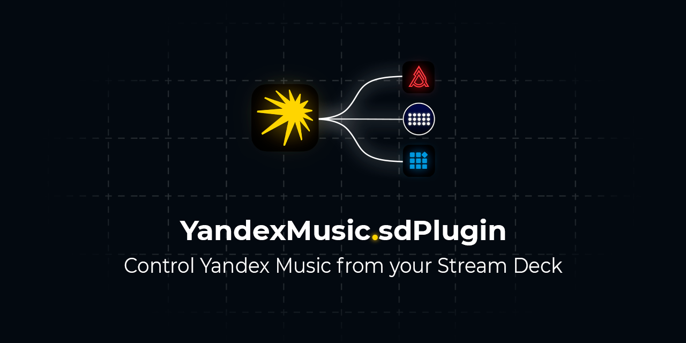

# Интеграция с Яндекс Музыкой

<p align="center">
  <a href="README.md">🇬🇧 English</a> | <a href="README_RU.md">🇷🇺 Русский</a>
</p>



<p align="center">
  <b>Управляйте Яндекс Музыкой прямо со Stream Deck</b><br>
  Быстро • Удобно • Без лишних танцев с бубном
</p>

<p align="center">
  <a href="https://github.com/Judd1zzz/yandex-music-streamdeck/releases"></a>
  <a href="https://github.com/Judd1zzz/yandex-music-streamdeck/releases"></a>
  <a href="https://github.com/Judd1zzz/yandex-music-streamdeck/stargazers"></a>
  <a href="https://github.com/Judd1zzz/yandex-music-streamdeck/blob/main/LICENSE"></a>
</p>

<p align="center">
  
  
  
</p>

---

## Совместимость

### Устройства

Плагин разрабатывался и тестировался на **аналогах Stream Deck**: Mirabox, Ajazz (AKP153) и подобных устройствах, работающих через приложение Ajazz Dock/Stream Dock.

**Оригинальный Elgato Stream Deck**: плагин запускается и отображает информацию корректно (проверено на windows 11, версия elgato stream deck 7.0.3). Полноценное тестирование всех функций ещё не проводилось — если найдёте баги, пишите в issues.

### Софт

Плагин работает на **v2** и **v3** версии софта. Если хотите скачать актуальную версию v3:

| Устройство | Windows | macOS |
|------------|---------|-------|
| **Ajazz** | [ajazz.key123.vip/win](https://ajazz.key123.vip/win) | [ajazz.key123.vip/mac](https://ajazz.key123.vip/mac) |
| **Mirabox / другие** | [key123.vip/win](https://key123.vip/win) | [key123.vip/mac](https://key123.vip/mac) |

<details>
<summary><b>Какой софт выбрать?</b></summary>

- Если у вас **Ajazz** — качайте по ссылкам с `ajazz` в адресе
- Если у вас **Mirabox** — качайте Stream Dock (ссылки без `ajazz`)
- Софт **Stream Dock от Mirabox** технически работает и с Ajazz:
  - На **Windows** — определяет железку нормально
  - На **macOS** — видит устройство, но не подключается корректно

Это происходит потому, что Ajazz AKP153 аппаратно — клон Mirabox StreamDock 293S, и система видит его под этим именем.

</details>

<details>
<summary><b>Для владельцев российской версии железки</b></summary>

В инструкции к устройству часто указаны ссылки вида `ajazz.key123.vip/RUSwin`. Если в конце ссылки есть **RUS** — вы скачаете устаревшую версию софта.

Качайте по обычным ссылкам без RUS. При первом запуске софт сам предложит переключить язык на русский.

</details>

---

## Что умеет плагин

### Базовое управление
- **Play/Pause** — ставьте на паузу и продолжайте воспроизведение
- **Вперёд/Назад** — переключайте треки
- **Лайк/Дизлайк** — влияйте на рекомендации "Моей Волны"
- **Mute** — выключайте звук, не теряя уровень громкости

### Громкость
- **Volume +/-** — регулировка громкости на 5% за нажатие
- **Индикатор громкости** — отдельная кнопка, показывающая текущий уровень

> **Длинное нажатие:** в коде реализована плавная регулировка при зажатии кнопки, но на некоторых аналогах Stream Deck она может не работать. Судя по всему, это техническое ограничение устройств — событие нажатия приходит только в момент отпускания кнопки. На оригинальном Stream Deck, скорее всего, всё будет нормально, но пока не проверено.

### Информация о треке
- **Обложка + название + исполнитель** — всё на одной кнопке
- **Бегущая строка** — длинные названия автоматически прокручиваются
- **Копирование** — нажмите на кнопку с обложкой, чтобы скопировать "Исполнитель - Трек" в буфер обмена
- **Прогресс-бар** — показывает, сколько осталось до конца трека

### Техническая база
- **Event-Driven архитектура** — мгновенный отклик, нулевая нагрузка в простое
- **Устойчивость к обновлениям** — `data-test-id` селекторы вместо хрупких CSS-классов
- **Standalone binary** — PyInstaller, не нужен Python или Node.js

---

## Установка

### 1. Скачайте плагин

Возьмите последний релиз из [Releases](https://github.com/Judd1zzz/yandex-music-streamdeck/releases) и распакуйте архив.

---

### 2. Положите папку плагина в нужное место

<details>
<summary></summary>

Папку `com.judd1.yandex_music.sdPlugin` нужно положить в папку плагинов.

Нажмите `Win + R`, вставьте этот путь и нажмите Enter:
```
%AppData%\HotSpot\StreamDock\plugins
```

</details>

<details>
<summary></summary>

Папку `com.judd1.yandex_music.sdPlugin` нужно положить в папку плагинов.

В Finder нажмите `Cmd + Shift + G` и вставьте:
```
~/Library/Application Support/HotSpot/StreamDock/plugins
```

> ⚠️ **Важно:** Поскольку у плагина нет платной подписи Apple Developer ID, macOS помечает его как "карантинный". После копирования выполните в терминале:
> ```bash
> xattr -cr ~/Library/Application\ Support/HotSpot/StreamDock/plugins/com.judd1.yandex_music.sdPlugin
> ```
> Без этого плагин не запустится и вылетит ошибка "Файл повреждён".

</details>

---

### 3. Запустите клиент Яндекс Музыки с флагом отладки

Это ключевой момент. Клиент нужно запускать со специальным параметром `--remote-debugging-port=9222`. Без него плагин просто не увидит приложение.

Почему так? Клиент Яндекс Музыки под капотом — это Electron-приложение (по сути, браузер). Флаг отладки открывает порт, через который плагин может "общаться" с приложением и управлять им.

<details>
<summary><b> — делаем специальный ярлык</b></summary>

1. Найдите **Яндекс Музыку** в меню Пуск
2. Правый клик → **Открыть расположение файла**
3. Правый клик на файле → **Создать ярлык**
4. Откройте свойства ярлыка (правый клик → Свойства)
5. В поле **Объект** допишите в самый конец (после закрывающей кавычки, через пробел):
   ```
   --remote-debugging-port=9222
   ```
   
   Получится что-то вроде:
   ```
   "C:\Users\...\Яндекс Музыка.exe" --remote-debugging-port=9222
   ```

6. Нажмите OK и закрепите этот ярлык где удобно

С этого момента запускайте музыку **только через этот ярлык**. Обычный запуск через Пуск работать не будет — это важно.

</details>

<details>
<summary> <b>— делаем приложение-обёртку</b></summary>
Можно каждый раз открывать терминал и вводить команду, но это быстро надоест. Проще один раз сделать приложение-лаунчер.

#### Создаём скрипт

1. Откройте **Редактор скриптов** (Script Editor) — найдите через Spotlight
2. Вставьте:
```applescript
do shell script "open -a '/Applications/Yandex Music.app' --args --remote-debugging-port=9222"
```

Если у вас приложение называется по-другому (например, "Яндекс Музыка.app"), поправьте путь.

#### Экспортируем как приложение

1. Файл → Экспортировать...
2. Имя: `Yandex Music Debug` (или любое другое)
3. Куда: Программы
4. Формат: Программа (Application)
5. Все галочки снимите
6. Сохраните

Теперь в папке Программы появится новый лаунчер. Запускайте музыку через него.

#### 😘 Бонус: красивая иконка

У нового приложения будет стандартная иконка скрипта. Чтобы вернуть оригинальный логотип Яндекс Музыки:

1. Найдите оригинальный Yandex Music.app в Программах
2. `Cmd + I` → кликните на иконку в левом верхнем углу окна → `Cmd + C`
3. Найдите ваш Yandex Music Debug.app
4. `Cmd + I` → кликните на иконку → `Cmd + V`

Готово, теперь лаунчер выглядит как оригинал и работает как надо.

</details>

---

### 4. Настройте кнопки

1. Откройте приложение Stream Deck (Ajazz Dock/Stream Dock)
2. Найдите категорию **Яндекс Музыка** в списке действий справа
3. Перетащите нужные кнопки на панель
4. Кликните на любую кнопку — в панели настроек внизу будет статус подключения

Если статус показывает "Подключено" — всё работает. Если нет — проверьте, что клиент Яндекс Музыки запущен через специальный ярлык/лаунчер.

---

## Настройки

В панели настроек каждой кнопки можно изменить:

| Параметр | Что делает |
|----------|------------|
| **Тип управления** | Local (клиент на ПК) или Ynison (облако, бета) |
| **Порт** | Порт подключения к клиенту (по умолчанию 9222) |
| **Стиль кнопки** | Внешний вид |
| **Отображаемые элементы** | Что показывать: обложку, название, исполнителя |

---

## Режим Ynison (экспериментальный)

> ⚠️ **Это экспериментальная штука для тех, кто любит ковыряться**

Ynison — это внутренний протокол Яндекса для синхронизации воспроизведения между устройствами. В теории через него можно управлять музыкой на телефоне, Яндекс.Станции или ТВ прямо со Stream Deck.

### Почему "экспериментальный"

На практике всё сложнее:

- **ПК-клиент Яндекс Музыки** вообще блокирует управление через Ynison. Существует [патч](https://github.com/TheKing-OfTime/YandexMusicModPatcher), который частично решает проблему, но полноценно это всё равно не работает. Я когда тестировал, очередь треков обновлялась, следующий трек отображался правильно, но само переключение на ПК не происходило.
- **Мобильные клиенты** (iOS, Android) работают нормально — там у Яндекса эталонная реализация протокола.

По сути, этот режим — демонстрация того, что технически так можно сделать. Когда Яндекс доделает свой протокол, всё заработает как надо. А пока — это игрушка для энтузиастов.

### Что нужно для запуска

1. Запустить локальный API-сервер (`api_for_plugin`)
2. Ввести токен авторизации в настройках плагина

---

## Техническое устройство

<details>
<summary><b>☁️ API-сервер для Ynison</b></summary>

Это отдельный FastAPI-сервер, который выступает прокси между плагином и протоколом Ynison. Плагин общается с ним по WebSocket и HTTP, а сервер уже поддерживает соединение с Яндексом.

#### Архитектура

```
┌─────────────────────┐      WebSocket       ┌───────────────────────┐
│   Stream Deck       │ ◀──────────────────▶ │   api_for_plugin      │
│   Plugin            │      /ws             │   (FastAPI)           │
└─────────────────────┘                      └───────────────────────┘
                                                       │
                                    ┌──────────────────┴──────────────────┐
                                    │                                     │
                                    ▼                                     ▼
                       ┌────────────────────────┐          ┌──────────────────────────┐
                       │   Ynison WebSocket     │          │   Yandex Music REST API  │
                       │   wss://ynison.music.  │          │   api.music.yandex.net   │
                       │   yandex.ru            │          │   (лайки, метаданные)    │
                       └────────────────────────┘          └──────────────────────────┘
```

#### Компоненты

| Файл | Что делает |
|------|------------|
| `main.py` | FastAPI-приложение, эндпоинты `/ws`, `/control/{action}`, `/check_token` |
| `manager.py` | Менеджер сессий. `SessionManager` держит активные `YnisonSession` для каждого токена |
| `yandex_api.py` | REST-клиент для Яндекс Музыки: лайки, дизлайки, метаданные треков |
| `ynison/player.py` | Реализация Ynison-плеера: подключение, команды, обработка state |
| `ynison/client.py` | Низкоуровневый WebSocket-клиент для Ynison |
| `ynison/models/` | Pydantic-модели для сериализации всех сообщений протокола |
| `utils/auth.py` | Хранилище токена и device_id для аутентификации |

#### Эндпоинты

**WebSocket `/ws`**
- Заголовок `Authorization: <token>`
- При подключении автоматически стартует Ynison-сессия для этого токена
- Получает real-time обновления состояния плеера (JSON)

**POST `/control/{action}`**
- Действия: `play_pause`, `next`, `prev`, `like`, `dislike`
- Заголовок `Authorization: Bearer <token>` или `Authorization: <token>`
- Возвращает `{"status": "ok"}`

**GET `/check_token`**
- Проверяет валидность токена
- Возвращает `{"valid": true}` или `{"valid": false}`

#### Сильные стороны

- **Многопользовательский режим** — один сервер на несколько пользователей, ленивые сессии
- **Обогащение метаданных** — Ynison даёт только ID, сервер дозапрашивает обложки и имена через REST
- **Синхронизация лайков** — при старте загружаются списки лайкнутых/дизлайкнутых
- **Отказоустойчивость** — автореконнект, таймауты, graceful shutdown
- **Pydantic-модели** — весь протокол типизирован и валидируется

#### Запуск

```bash
cd api_for_plugin
pip install -r requirements.txt
python main.py
```

Сервер запустится на `http://0.0.0.0:8000`

</details>

<details>
<summary><b>🖥️ Как работает Local режим (CDP)</b></summary>

Local режим использует Chrome DevTools Protocol для управления клиентом Яндекс Музыки напрямую, без сторонних серверов.

#### Архитектура

```
┌─────────────────────┐                     ┌───────────────────────────────────────┐
│                     │                     │       Яндекс Музыка (Electron)        │
│    Stream Deck      │                     │                                       │
│      Plugin         │                     │   ┌───────────────────────────────┐   │
│     (Python)        │      WebSocket      │   │       injected_api.js         │   │
│                     │ ◀─────────────────▶ │   │   (инжектированный скрипт)    │   │
│                     │  ws://localhost:    │   │                               │   │
│  CDPMediaController │  .../devtools/page  │   │      window.sdNotify() ──────▶│───│──▶ Runtime.bindingCalled
│                     │                     │   │      (обратный вызов)         │   │
└─────────────────────┘                     │   └───────────────────────────────┘   │
         │                                  │                                       │
         │ HTTP GET                         │   CDP Debug Port :9222                │
         └─────────────────────────────────▶│   (--remote-debugging-port)           │
           /json (получить WS URL)          └───────────────────────────────────────┘
```

#### Поток данных

1. **Подключение:**
   - Плагин запрашивает `http://localhost:9222/json` для получения WebSocket URL
   - Открывает WebSocket-соединение к странице через CDP
   - Вызывает `Runtime.addBinding("sdNotify")` для регистрации callback'а

2. **Инъекция скрипта:**
   - Плагин инжектит `injected_api.js` через `Runtime.evaluate`
   - Скрипт создаёт объект `window._PyYMController`
   - Скрипт начинает наблюдение через `MutationObserver`

3. **Получение обновлений (event-driven):**
   - При изменении состояния плеера скрипт вызывает `window.sdNotify(JSON)`
   - CDP доставляет это через событие `Runtime.bindingCalled`
   - Плагин парсит payload и обновляет UI

4. **Отправка команд:**
   - Плагин вызывает `Runtime.evaluate` с методом контроллера
   - Например: `_PyYMController.togglePlayPause()`
   - Скрипт находит нужную кнопку и эмулирует клик

#### Компоненты плагина

| Файл | Что делает |
|------|------------|
| `src/core/cdp.py` | Singleton `CDPMediaController`: подключение, RPC, обработка событий |
| `src/core/scripts/injected_api.js` | JS-контроллер: DOM-наблюдение, delta-обновления, команды |
| `src/core/schemas/states.py` | `dataclass(slots=True)`: `MediaState`, `TrackData`, `PlaybackData` — для скорости |
| `src/core/schemas/events.py` | Pydantic-модели для событий Stream Deck (нужна валидация JSON) |
| `src/actions/*.py` | Кнопки: подписываются на события через `register_observer` |

#### Почему это надёжно

- **`data-test-id` селекторы** — стабильны между версиями Яндекс Музыки
- **Fallback-цепочки** — если основной селектор не найден, пробуем альтернативные
- **Delta-обновления** — передаём только изменившиеся поля, не весь стейт
- **Optimistic UI** — кнопки обновляются сразу при нажатии
- **Автореконнект** — при разрыве соединения плагин переподключается автоматически

</details>

## Для разработчиков

### Локальное тестирование без сборки

Если хотите просто потестить или поковырять код — собирать бинарник необязательно. Достаточно запускать плагин через скрипт:

- **macOS**: `run.sh`
- **Windows**: `run.bat`

В `manifest.json` укажите соответствующий файл в полях `CodePathMac` / `CodePathWin`.

### Полная сборка

```bash
git clone https://github.com/Judd1zzz/yandex-music-streamdeck.git
cd yandex-music-streamdeck

python -m venv env
source env/bin/activate  # Windows: env\Scripts\activate

pip install -r requirements.txt
pip install pyinstaller

python tools/build.py
```

Готовый плагин появится в `dist/com.judd1.yandex_music.sdPlugin`.

---

## Проблемы?

| Симптом | Что делать |
|---------|------------|
| Кнопки не реагируют | Проверьте, что клиент запущен с флагом `--remote-debugging-port=9222` |
| Вечный "Loading..." | Порт 9222 скорее всего занят чем-то другим, или клиент не запущен |
| Фиолетовые иконки | Перезапустите Stream Deck |
| Длинное нажатие не работает | Вероятно, ограничение вашего устройства (см. раздел "Громкость") |

---

## Лицензия

MIT. Делайте что хотите.

---

## Благодарности

- **[Yandex-Music-Ajazz-Plugin](https://github.com/whxtelxs/Yandex-Music-Ajazz-Plugin)** — спасибо автору за идею использования `--remote-debugging-port` для подключения к клиенту через CDP.
- **[YandexMusicModPatcher](https://github.com/TheKing-OfTime/YandexMusicModPatcher)** — патч для работы Ynison на десктопном клиенте.
